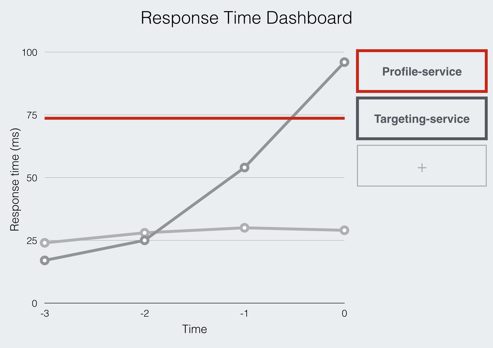

# Response Time Dashboard

## Goals:

* Build UI in Elm
* Visualise data using D3 via `elm-d3`
* Use Websockets

## What is it?

We're using a micro-service architecture at work which means when something breaks, it takes time to figure out which link in the chain is causing problems. As an excuse for having a play with Elm, D3 and Websockets, this is my attempt at a system-health dashboard.

A node app on the back-end will ping services within the cluster and log the response times to an Elm front-end using Websockets. It might look something like this:

